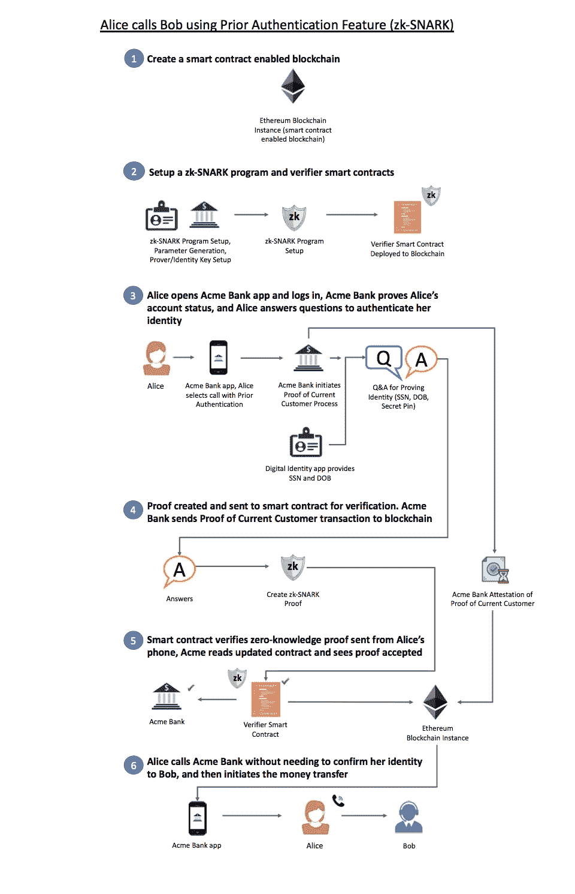
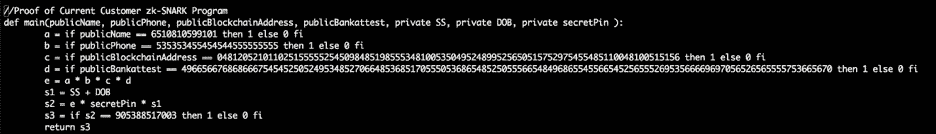
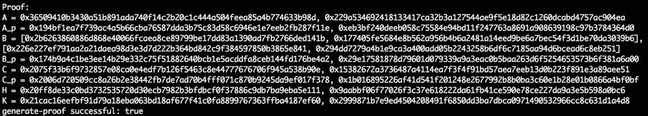

# ZK-SNARKs——一个现实的零知识示例和深度探究

> 原文：<https://medium.com/coinmonks/zk-snarks-a-realistic-zero-knowledge-example-and-deep-dive-c5e6eaa7131c?source=collection_archive---------0----------------------->

欢迎回来！让我们更深入地了解 zk-SNARKs。

注意:除非你对 zk-SNARKs 很熟悉，否则我会建议你阅读这个博客系列的[第 1 部分](/@adamluc/digital-identity-privacy-and-zero-knowledge-proofs-zk-snarks-3d092b509990)。

*快速回顾:zk-SNARK 中有两个主要团体，证明者和验证者。使用 zk-SNARK，证明者希望向验证者保证一个知识声明，而不向验证者透露确切的知识是什么。*

> [发现并回顾最佳区块链软件](https://coincodecap.com)

**什么是 zk-SNARK？**

在讨论一个更技术性的例子之前，让我们先来看看 zk-SNARK 必须满足哪些属性:

1.  **完备性**:如果陈述为真，并且验证者和证明者诚实，则证明被接受。
2.  **可靠性**:如果陈述是假的，除非有极小的概率，否则欺骗证明者无法说服诚实的验证者这是真的。

除了以上所述，zk-SNARK(零知识简洁的非交互式知识论证)需要:

1.  **零知识:**如果陈述为真，验证者除了陈述为真的事实之外不会学到任何东西。
2.  **简洁**:证明的大小需要小到可以在几毫秒内被验证。
3.  **非交互式**:只有一组信息发送给验证者进行验证，因此证明者和验证者之间没有来回通信。
4.  **论证**:计算上合理的证明:合理性反对利用[多项式时间](http://1-	http://mathworld.wolfram.com/PolynomialTime.html)，即有界计算的证明者。
5.  **知识**:没有证人(证明陈述所需的私人输入)，证据无法构建。

给定上述条件，让我们通过一个 zk-SNARK 的例子，并结合如何将它与区块链结合使用。使用帖子#1 中 Bob 和 Alice 之间的第一个例子:Alice 希望将钱从她的一个银行账户转移到另一个银行账户，并且需要 Bob 发起转移——让我们描述如何使用 zk-SNARKs 和区块链来实现该场景。

***注意:下面的例子是不可扩展的，但是提供了一个如何处理 zk-SNARK 的很好的概述。***

我们场景中的四个角色:

Alice — Prover

2.

Acme Bank — Verifier, Trusted third party for bank account attestation transaction, & a trusted third party for zk-SNARK setup

3.

Bob — Acme Bank call center representative

4.

Self-Sovereign Identity Solution — Data provider of digital identity information to Acme Bank App, and a trusted third party for zk-SNARK setup

下面是一个图表示例，说明 Alice 如何在不提供 Bob at Acme 银行信息来验证其身份的情况下，将资金从她的一个银行帐户转移到另一个帐户:

**1。创建一个支持智能合约的区块链，在这个例子中，我们使用一个以太坊实例。**

**2。创建一个程序，如果该程序评估为真，则返回“1”(博客文章末尾的程序示例)。**

2a **。**输入包括由多方(Alice，(自我主权身份解决方案)和 Acme 银行)使用的公共输入，以及只有证明者(Alice)提供的私有输入(秘密，又名见证)。

2a _ I . Public:Alice 作为当前银行账户所有者的姓名、电话号码、区块链数字身份地址、银行证明——最近完成；1 小时超时(将在下面进一步描述)

2a_ii。私人(爱丽丝或自我主权身份解决方案):社会安全号码(SSN)，出生日期(出生日期)

2a_iii。私人(仅爱丽丝):秘密 Pin

b.设置 zk-SNARK 参数并生成证明者和验证者密钥。

2b。使用 Self-Sovereign Identity solution 和 Acme Bank 之间的多方计算(MPC)来生成设置 zk-SNARK 的公共参数。MPC 允许多方参与可信设置阶段来生成 zk-SNARK 的参数，这相对于一方创建密钥来说，将风险降至最低。如果参与可信设置阶段的用户之一没有受到危害，则生成的参数是安全的。如果参与设置的所有用户都受到危害，则这些参数可用于生成虚假证明，从而消除 zk-SNARK 过程的价值。

2c。验证者密钥和验证者程序嵌入在一个智能合同中，该合同在以太坊区块链实例中被实例化。

**3。Alice 打开 Acme bank 的应用程序，使用她的指纹向应用程序验证她的身份，然后进入应用程序。**

3a。她转到应用程序中的“联系我们”区域，点击“使用预先身份验证呼叫 Acme”按钮。

3a_i .在 Alice 点击“Call Acme with Prior authentic ation”按钮之后，在幕后:1)从 Alice 的 Acme bank 应用向 Acme Bank 发送请求，询问 Alice 是否仍然是银行客户。2)然后，Acme Bank 向区块链发送交易，声明 Alice 仍然是当前客户。

3a_ii。在移动应用程序中向 Alice 询问以下问题(其中一些问题(社会安全号码和出生日期)可以通过向银行应用程序提供数据的数字身份应用程序来回答，如自我主权身份解决方案):

3a_ii_1。你的社会安全号码是多少？爱丽丝进入:123–45–6789

3a_ii_2。你的出生日期是什么时候？爱丽丝进入:2000 年 1 月 1 日

3a_ii_3。你的秘密密码是什么？爱丽丝进入:7327；为什么是秘密别针？这是为了防止有人以某种方式访问该应用程序，并利用数字身份应用程序填充社会安全号码和出生日期的答案，然后尝试以 Alice 的身份与银行进行交互，而实际上并不是 Alice。秘密 pin 充当不能被外人知道的验证个人身份的最后一道障碍。

**4。Alice 的回答(私人输入也称为证人)与 Alice 的姓名、电话号码、公共数字身份地址和 Alice 是当前客户的银行证明的公共输入合并，以生成零知识证明(zk-SNARK)。**

4a。该证明被发送到区块链的验证智能合同。

**5。智能合约返回“true ”, Acme Bank 对此进行监控，并在其内部系统中记录“true”的响应。**

**6。Acme 移动应用程序中的一个按钮现在可供 Alice 呼叫 Acme 银行。Alice 点击按钮，然后被转接到 Acme 银行呼叫代表 Bob，以启动银行转账。**

上面的例子提供了当 Alice 想要呼叫 Acme Bank 来启动从她的一个账户到另一个账户的转账时 zk-SNARK 如何工作的分解。上述示例消除了 Alice 与 Bob 共享敏感身份信息的情况，并额外减少了 Acme bank 的平均处理时间，从而降低了成本，这对 Alice 和 Acme Bank 都是双赢的。

**当前客户的第三方信任和证明**

在现实世界中工作的 zk-SNARK 的上述例子中的一个关键元素是 Alice 在 Acme 银行有一个帐户的银行证明。在提供 zk-SNARKs 的示例时，这是一个经常被忽略的关键因素，即当有第三方需要参与 zk-SNARK 流程时，如何将其纳入？可以有不同的方法，但是我们可以加入一种形式的[存在证明](http://2-	https://en.wikipedia.org/wiki/Proof_of_Existence)，我们称之为当前客户的证明，使上面的例子成为一个更现实的实现。

对于 Acme bank，当前客户的证明可以按以下方式工作:

1.  当 Alice 首次成为客户或已经是客户时，银行将通过向 Alice 在相关区块链的公共数字身份地址发送交易来证明 Alice 是银行的客户。(交易将包含加密的数据有效载荷，Alice 的 Acme 银行移动应用程序将读取该有效载荷，以指示 Alice 是 Acme 银行的客户。)
2.  将通过检查 Acme 的公共地址来验证发行者身份(Acme Bank)。在区块链中，智能合同中会有一个公共地址注册中心(该注册中心将存储公共地址及其相关身份)，因此 Acme Bank 可以被标识为原始证明的颁发者。注册表只能由某些选定的所有者或合同注册表的创建者更新。
3.  接下来，从 Acme Bank 向 Alice 的公共数字身份地址发送一个新交易，该交易带有加密的数据有效负载，表明 Alice 是 Acme Bank 的客户，并且她可以在接下来的 60 分钟内呼叫 Acme Bank，而无需事先进行身份验证。

*注意:有多种方法可以达到上述目的。例如，除了使用简单的事务，我们还可以利用存储在分散存储系统中的文档，该系统保存相关数据，然后可以使用这些数据来验证 Acme Bank 的底层客户数据和数字签名。*

在上面的例子中，Alice 能够与 Acme 银行的 Bob 通信而不共享关于她自己的信息，并授权从她的一个银行账户向另一个账户转账。zk-SNARKs 和区块链可以很好地合作:在隐私、安全和透明之间架起桥梁，以交换和验证信息。

除了上述场景之外，zk-SNARKs 还可以用于广泛的领域，例如:

1.计算验证(集中、分散)

2.匿名加密货币或能够在智能合约中使用 zk-SNARKs 的加密货币，例如:Zcash、以太坊(保护用户隐私)

3.公共/私人区块链之间的出处证明(a .证明可以存储在公共区块链上，而不是将私人区块链中发生的交易的所有数据记录到公共区块链上。这使公司能够保护其敏感数据的安全，同时证明特定交易的来源。)

4.无需密码的身份验证(如上面 Alice 和 Bob 的示例所示)

5.有条件地分享关于自己身份的信息，例如:Alice is > 21 是真还是假？(年龄未透露)，zk-SNARK 可用于证明 Alice 超过 21 岁，同时最小化相关方之间所需的信任(例如，共享 PII、健康数据、贷款数据)

zk-SNARKs 的广泛应用可能会改变数据的存储方式。也许公司不需要像现在这样保存大量的客户/用户数据。在未来，组织可以与区块链进行交互，并使用零知识证明与当前流程进行通信，从而减少数据泄露，进一步提高用户数据的隐私性，并降低组织的风险。还可以进一步减少人与人之间的机密数据共享。零知识证明和自我主权身份的应用将允许用户更充分地保护他们的数据，并进一步最小化数据泄露，因为拥有个人身份数据的重要方面的组织将开始衰落。

可以进一步改进以最小化 zk-SNARK 用户信任的一个关键领域是删除可信设置阶段。零知识密码术的研究正在进行，正在开发的技术如 [zk-STARKS](http://3-	https://themerkle.com/mit-review-acclaims-zk-snarks-but-zk-starks-may-steal-the-show/) 消除了可信设置阶段，进一步改进了使用零知识密码术提供知识证明的过程。在下一篇文章中，我将深入研究 zk-STARKs。

**Alice 和 Bob 调用的更深一层的验证示例—仅 zk-SNARK 程序输入和输出(示例使用了**[**zok rates**](http://4-	https://www.coindesk.com/zokrates-seeks-bring-best-zcash-ethereum-devcon-debut/)**):**

对于那些对基本的 zk-SNARK 程序感兴趣的人，我想基于上面的 Alice 和 Bob 的例子提供下面的例子。

1.  zk-SNARKs 可以很好地处理数字，所以我们需要将字符串输入转换为数字(使用以下网站来转换文本字符串:[*https://cryptii.com/decimal-text*)。](https://cryptii.com/decimal-text).)
2.  公开名:爱丽丝；运行 Unicode 十进制转换器得到:65 108 105 99 101，删除所有空格并输入: **6510810599101**
3.  公共电话号码:(555–666–7777)；运行 Unicode 十进制转换器得到:53 53 53 45 54 54 54 45 55 55 55 55 55，删除所有空格并输入:**53535345545445455555555**
4.  公有区块链地址:0x4ef 377462 b 03 b 750d 52140 c 482394 a 6703 d0 d 338；运行 Unicode 十进制转换器得到:0 48 120 52 101 102 51 55 55 52 54 50 98 48 51 98 55 53 48 100 53 50 49 52 48 99 52 56 50 51 57 52 97 54 55 48 51 100 48 100 100 100 51 51 56，删除所有空格并输入:**0481205210101110202**
5.  公共银行证明设置和调用: **a.** 初始设置:Acme Bank 向 Alice 的公共数字身份地址发送交易，该交易具有指示 Alice 是客户的数据有效载荷。当 Alice 开立账户时，或者当 Alice 第一次在 Acme Bank 的移动应用程序上验证她的账户时，就会发生该交易。 **b.** 当 Alice 开始“具有优先认证的呼叫”过程时，银行将检查 Alice 的公共数字身份账户交易中来自 Acme 银行的指示 Alice 是 Acme 银行的客户的交易。如果找到，Acme bank 将向 Alice 的公共数字身份地址发送交易，该交易具有加密的数据有效载荷，该数据有效载荷指示 Alice 是 Acme bank 的当前客户。Alice 的手机会监视来自 Acme Bank 的新交易的区块链，一旦找到，就会从最近的交易中提取数据有效负载，解密数据，并对数据进行哈希处理。散列后的数据将被转换成 Unicode 十进制字符串进行输入:**4966566768686675454545250524953485685170555536856548555565556555655655654565456556545654565455655565556953565666666956666956666969700。**
6.  私人社会安全号码:123–45–6789；输入方式: **123456789**
7.  私人出生日期:2000 年 1 月 1 日；作为输入输入: **112000**
8.  私人密码输入(这是用户必须记住的密码): **7327**
9.  公共和私有输入将被输入到下面的程序中，该程序将公共输入与 zk-SNARK 程序中所写的内容进行比较。如果它们是正确的，程序将把社会安全号码和出生日期的总和乘以秘密 pin 来生成目标号码。如果该数字与 zk-SNARK 程序中的数字相同(905388517003)，程序将返回 1。下面用 ZoKrates 编写的代码提供了一个例子:

ZoKrates code for zk-SNARK example

10.程序执行后，会生成一个类似下图的证明:

zk-SNARK (zero-knowledge proof) output from ZoKrates

11.然后，上述证明连同公共输入(Alice 的姓名、电话号码、区块链地址、银行证明散列和预期输出‘1’)一起被发送到验证智能合同。如果所有信息都是最新的，则合同将返回“true”，输出存储在智能合同中，因此合同的观察者可以看到结果(Alice 的移动应用程序和 Acme Bank 可以看到合同中的状态变化)。验证契约内部有硬编码的验证密钥，因此它可以根据公共输入和提供的证明来确定证明是否为真。

> 加入 Coinmonks [电报频道](https://t.me/coincodecap)和 [Youtube 频道](https://www.youtube.com/c/coinmonks/videos)获取每日[加密新闻](http://coincodecap.com/)

## 另外，阅读

*   [复制交易](/coinmonks/top-10-crypto-copy-trading-platforms-for-beginners-d0c37c7d698c) | [加密税务软件](/coinmonks/crypto-tax-software-ed4b4810e338)
*   [网格交易](https://coincodecap.com/grid-trading) | [加密硬件钱包](/coinmonks/the-best-cryptocurrency-hardware-wallets-of-2020-e28b1c124069)
*   [密码电报信号](http://Top 4 Telegram Channels for Crypto Traders) | [密码交易机器人](/coinmonks/crypto-trading-bot-c2ffce8acb2a)
*   [Pionex 双投](https://coincodecap.com/pionex-dual-investment) | [AdvCash 审核](https://coincodecap.com/advcash-review) | [光宗耀祖审核](https://coincodecap.com/uphold-review)
*   [面向开发者的 8 个最佳加密货币 API](https://coincodecap.com/best-cryptocurrency-apis)
*   [支持卡审核](https://coincodecap.com/uphold-card-review) | [信任钱包 vs 元掩码](https://coincodecap.com/trust-wallet-vs-metamask)
*   [赢取注册奖金——10 大最佳加密平台](https://coincodecap.com/earn-sign-up-bonus)
*   [最佳加密交易所](/coinmonks/crypto-exchange-dd2f9d6f3769) | [印度最佳加密交易所](/coinmonks/bitcoin-exchange-in-india-7f1fe79715c9)
*   [面向开发人员的最佳加密 API](/coinmonks/best-crypto-apis-for-developers-5efe3a597a9f)
*   最佳[密码借贷平台](/coinmonks/top-5-crypto-lending-platforms-in-2020-that-you-need-to-know-a1b675cec3fa)
*   [杠杆代币](/coinmonks/leveraged-token-3f5257808b22)终极指南