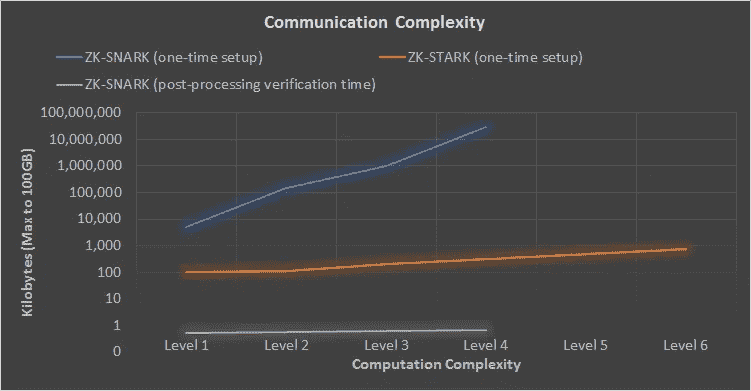
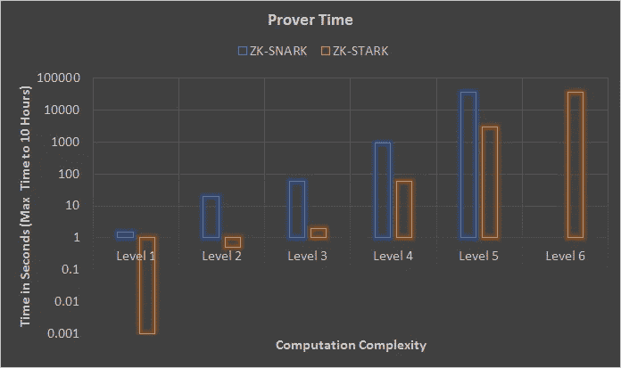
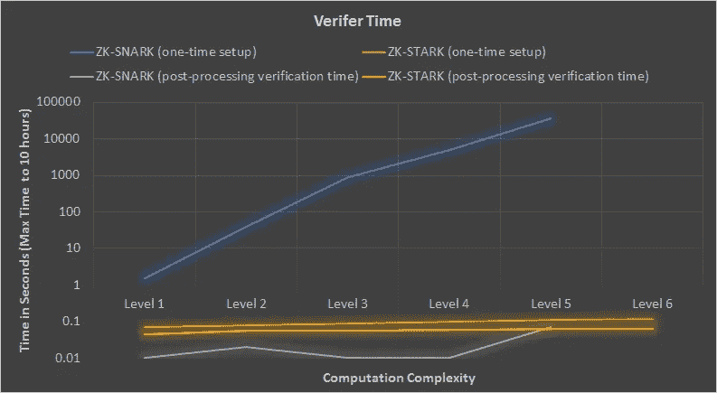
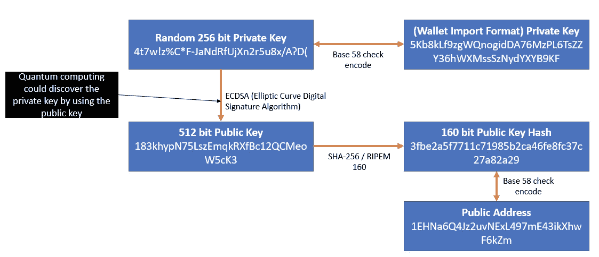

# ZK-斯塔克斯——创造可验证的信任，甚至对抗量子计算机

> 原文：<https://medium.com/coinmonks/zk-starks-create-verifiable-trust-even-against-quantum-computers-dd9c6a2bb13d?source=collection_archive---------0----------------------->

*注:除非你对零知识证明或 ZK-斯纳克很熟悉，否则我会建议阅读本博客系列的* [*第一部分*](https://cryptodigestnews.com/digital-identity-privacy-and-zero-knowledge-proofs-zk-snarks-3d092b509990) *和* [*第二部分*](/coinmonks/zk-snarks-a-realistic-zero-knowledge-example-and-deep-dive-c5e6eaa7131c) *。*

既然我们已经讨论了 ZK-斯纳克法，让我们扩展到 ZK-斯纳克法的一些问题，并讨论零知识密码学的最新创新:[ZK-斯塔克斯](https://eprint.iacr.org/2018/046.pdf)(零知识可扩展的透明知识论证)。

ZK-斯纳克法案有几个潜在的问题，这些问题将导致在区块链和其他潜在的实施中利用零知识加密的采用减少:

1.  可信设置阶段可能受到损害(有一个潜在的假设，即当使用 ZK-斯纳克系统时，可信设置阶段是安全的)
2.  ZK-斯纳克法的可伸缩性是可以改进的，随着运行时间的增加，生成特别是验证证明所需的时间也需要改进
3.  ZK-斯纳克密码术容易受到量子计算机的攻击

让我们逐一分析上述问题，并与未来的 ZK-斯塔克斯进行比较。

**可信设置阶段**

如果政府或强大的实体试图激励参与 ZK-斯纳克系统设置的各方共享设置参数会怎样？如果那个强大的实体成功了，他们将能够在一个众所周知可信的系统中生成虚假证明。例如，如果一个国家的总统选举在使用 ZK-斯纳克法来证明选票的区块链上进行，那么对于该实体来说，发现设置参数并因此改变选举结果可能有很大的激励。该实体可以通过为正在进行的投票创建虚假证明来使选举向他们想要的方向倾斜。

ZK-斯纳克方法的最大问题是，用户需要在设置阶段完全信任参与设置系统的各方。系统的用户永远也不会知道设置阶段是否在设置时或者在未来的某个时间点受到了损害。因此，如果是这种情况，系统的大门仍然是敞开的，用户不需要隐含地信任参与系统设置的各方是诚实的。当一个系统被用来规避这个系统的动机很强时，就会有人去寻找规避它的方法。

在 ZK-斯塔克斯，没有外部可信设置阶段，使用的随机性是公开信息。公共随机性的利用对于公众信任零知识证明系统是非常重要的，否则强大的实体可以施加他们的影响来获得设置参数并生成假证明。假定没有第三方可信设置阶段，而是使用公开可验证的随机性，ZK-斯塔克系统创建可验证的信任。

**可扩展性**

对于那些关注区块链领域持续技术挑战的人来说，可伸缩性讨论是中心话题。尽管超出了这篇博文的范围，但是有很多方法可以扩展区块链，都有相关的权衡。对于 ZK(零知识)证明系统，系统的可伸缩性对于实现广泛和持续的采用是至关重要的。ZK-斯塔克斯比 ZK-斯纳克斯表现出更高的可扩展性。让我们将 ZK-斯塔克与 ZK-斯纳克计算的相关复杂性分为与可扩展性相关的四个不同类别(结果来自[ZK-斯塔克白皮书](https://eprint.iacr.org/2018/046.pdf)):

1.算术电路复杂性(算术电路是计算多项式的标准方法，其中可以计算加法和乘法):在 ZK-斯纳克和 ZK-斯塔克系统中，创建 ZK 程序的代码以这样一种方式编写，即将它们分解成[电路](https://en.wikipedia.org/wiki/Circuit_(computer_science))，然后进行计算——实际上，电路复杂性的简单性与其计算效率相关。在下图中，算术复杂度基本上等同于用于生成证明的底层计算的大小和复杂性。(*下面的复杂性图表基于系统的总体复杂性，主要关注乘法门；关于参数设置，参见 ZK-斯塔克白皮书* *第 11 页。)*

2.通信复杂度(通常定义为解决两方或多方之间分配的问题所需的通信量):随着计算规模的增长，ZK-斯纳克的通信复杂度也以线性方式增长，与 ZK-斯塔克相反，-斯塔克仅随着计算规模的增长而略微增长——这是 ZK-斯塔克相对于 ZK-斯纳克在一次性设置方面的一大优势。在设置阶段之后，SNARKs 目前在验证证据时比 STARKs 具有更少的通信复杂性。

3.证明者复杂度:随着计算规模的增加，ZK-斯塔克斯比 ZK-斯纳克斯快 10 倍，这是 ZK-斯塔克斯相对于 ZK-斯纳克斯的另一个优势。

4.验证器的复杂性:随着计算规模的增长，ZK-斯塔克斯与 ZK-斯纳克斯相比仅略有增长，后者往往以线性方式增长，这是 ZK-斯塔克斯与 ZK-斯纳克斯在一次性设置方面的一个显著优势。在设置阶段之后，SNARKs 目前需要的验证时间比 STARKs 少，例如 STARKs 可能需要 50-100 毫秒来验证，而 SNARKs 需要大约 10 毫秒来验证。

下面是在[ZK-斯塔克白皮书](https://eprint.iacr.org/2018/046.pdf)中完成的 ZK-斯塔克斯与 ZK-斯纳克斯之间的基准分析的简单视图。

The above simplified benchmarking illustrates that the ZK-STARK’s required communication to complete the computation rises much slower than the ZK-SNARK as the underlying proof increases in complexity. Level 1 — Level 6 refer to arithmetic circuit complexity (levels of multiplication gates, each level increase is ~55x of the previous level) Level 5 & 6 are not shown as the size of communication exceeds 100GB). ZK-SNARK post processing verification time refers to when a SNARK is verified.

The above simplified benchmarking illustrates that the ZK-STARK’s time to generate a proof rises much slower than the ZK-SNARK as the underlying proof increases in complexity. Level 1 — Level 6 refer to arithmetic circuit complexity (levels of multiplication gates, each level increase is ~55x of the previous level) Level 6 is not shown as the time to completed exceeds 10 hours).

The above simplified benchmarking illustrates that the ZK-STARK’s time to verify a proof rises very slowly compared to the ZK-SNARK as the underlying proof increases in complexity. Level 1 — Level 6 refer to arithmetic circuit complexity (levels of multiplication gates, each level increase is ~55x of the previous level) Level 6 is not shown as the time to completed exceeds 10 hours). ZK-STARK and SK-SNARK post processing verification time refers to when the STARK/SNARK is verified.

*图表数据来源:*[*ZK-斯塔克白皮书*](https://eprint.iacr.org/2018/046.pdf)*；注意图表是从白皮书中复制的——它们是为了比较 ZK-斯纳克法和 ZK-斯塔克法而简化的。*

在证明系统中，有一个陈述，证明者希望向任何想要验证该陈述的人断言该陈述为真。例如:

证明者声明:Alice 想要证明她是 Acme 银行账户的所有者。

实际上，当您将上面的语句(在[帖子#2](/coinmonks/zk-snarks-a-realistic-zero-knowledge-example-and-deep-dive-c5e6eaa7131c) 中的代码逻辑中分解的语句)分割成多个片段，以供零知识电路计算并生成证明时，验证者会用数学方法检查证明以及相关验证者密钥的正确性。这个过程(尤其是验证过程)通过使用一种称为快速 Reed-Solomon 交互式 Oracle Proof of Proximity 的新算法大大加快了速度。关于用于提高 ZK-斯塔克可扩展性的新算法的更多细节，我建议阅读 [Vitalik Buterin](https://medium.com/u/587a00dbce51?source=post_page-----dd9c6a2bb13d--------------------------------) 的博客文章进行深入分析。

1.  STARKs，第一部分:多项式证明
2.  斯塔克斯，第二部:谢天谢地，今天是星期五
3.  斯塔克斯，第三部:走进杂草中

**量子计算**

最近，量子计算已经成为一个有趣的话题，某种程度上在区块链世界也是如此([量子位协议](https://medium.com/u/84b5e49a93e0?source=post_page-----dd9c6a2bb13d--------------------------------)是一家有趣的区块链初创公司)。IBM 和英特尔都在致力于开发量子计算机，然而，目前的估计表明量子计算距离广泛采用还有几年时间。量子计算确实给区块链系统带来了风险。让我们深入了解一下为什么量子计算机会对区块链密码学的某些方面带来风险。

经典计算机(我们今天使用的计算机)用比特操作，比特存储两种状态中的一种，0 或 1。量子计算机使用[量子位](https://en.wikipedia.org/wiki/Qubit)(类似于比特)进行操作，这些量子位以 0 或 1 的形式存储状态，然而，通过一种叫做[叠加的原理](https://en.wikipedia.org/wiki/Superposition_principle)在不被测量时也同时存在于 0 和 1 之间(量子位的一个例子可以是光子、原子核或电子)。由于量子比特的独特性质，它们可以用来做一些经典计算机和比特无法实现的有趣事情。

量子计算机将被设计为描述量子位之间的所有相关性，即通过 2^n (n =每个系统中每个量子位的相关性)有效地指数增加特定操作的计算吞吐量。比如 2 量子位= 4 经典位，3 量子位= 8 位，20 量子位= 1048576 位。考虑到量子计算机可以并行处理数据，而不是串行处理数据(就像经典计算机一样)，它们可以显著加快某些计算，如数据库搜索或从公钥中找到私钥。

**量子计算对区块链的影响**

量子计算机并不擅长所有事情，只擅长特定算法可以利用的特定类型的计算。例如，有一种算法称为 [Shor 的](https://en.wikipedia.org/wiki/Shor%27s_algorithm)算法，它可以在量子计算机上运行，并将具有并行运行非常快速的[整数因式分解](https://en.wikipedia.org/wiki/Integer_factorization)计算的能力(整数因式分解是将一个合数分解为小整数的乘积的过程，可用于从公钥中找到私钥；私钥和公钥基本上都是非常大的数)，从而找到任何给定整数的质因数。

现在的很多加密方案都不会抗量子计算攻击，比如 RSA 和 [ECDSA](https://hackernoon.com/eliptic-curve-crypto-the-basics-e8eb1e934dc5) (椭圆曲线密码)。比特币和以太坊使用 ECDSA 来生成私钥和公钥。例如，下面是比特币用于生成私钥、公钥和公共地址的过程的基本描述。

Bitcoin key generation and bitcoin public address generation

私钥由增加了熵(随机性)的数生成，公钥由私钥生成，公共地址由公钥的散列生成。量子计算机可以利用 Shor 算法从公钥推导出私钥，然后利用私钥伪造交易或窃取用户的余额(比特币/以太坊)。

Shor 算法主要是一个重用地址的问题。对于尚未使用的地址，量子计算机可以利用[格罗弗的](https://en.wikipedia.org/wiki/Grover%27s_algorithm)算法来求解 SHA-256 或 SHA3–256，以从公钥哈希中找到公钥，然而量子计算机只能用今天经典计算机的一半时间找到公钥。即使有一半的时间，在地球上任何人的有生之年都找不到钥匙。此外，merkle-tree 散列法目前不易受到量子计算攻击。

目前正在开发的算法将很难被量子计算机破解，如[基于晶格的密码术](https://en.wikipedia.org/wiki/Lattice-based_cryptography)或[多元密码术](https://en.wikipedia.org/wiki/Multivariate_cryptography)，它们可能是比特币和以太坊等区块链未来替代 ECDSA 的候选。

ZK-斯塔克斯不依赖于私钥-公钥配对(例如 ECDSA)，而是依赖于用于交互式解决方案的抗冲突哈希(Grover 的算法并没有有意义地破坏该解决方案)，以及用于非交互式证明(zk-nSTARK，n =非交互式)的随机 oracle 模型(该模型通常用于代替一般的加密哈希函数，其中 oracle 输出需要强随机性假设)，因此 ZK-斯塔克斯目前能够抵抗量子计算机攻击。

量子计算机还有几年的时间(估计是 2026 年到 2035 年)，所以现在没有必要担心它们的能力。此外，我在这篇文章中使用了术语量子电阻，因为量子电阻和量子证明是两个需要思考的术语。就像防水到一定深度的手表和防水(防水)的手表一样，在量子计算机的真正能力为人所知之前，很难说是否可以找到一种算法，利用量子计算机来规避当前潜在的量子抗加密算法。因此，在主流量子计算更接近成为现实之前，我们可能不会看到比特币或以太坊中使用的加密算法发生变化。

另外一个视频有助于理解经典计算机和量子计算机的区别:[https://www.youtube.com/watch?v=JhHMJCUmq28](https://www.youtube.com/watch?v=JhHMJCUmq28)

**当前状态和最终想法**

目前，加密货币 Zcash 中提供了 ZK-斯纳克，以及图书馆 libSNARK，以构建可以在区块链利用的 ZK-斯纳克程序。ZK-斯塔克斯是一项较新的技术，截至 2018 年 6 月尚未投入生产。有一家名为 [StarkWare Industries](https://medium.com/u/373f5878a0c6?source=post_page-----dd9c6a2bb13d--------------------------------) 的新公司正在寻求解决利用 ZK-斯塔克斯(其中一个是证明的大小)的一些挑战，并将这项技术商业化，这项技术可以在多个行业中利用，包括区块链的实施。

ZK-斯塔克斯是可扩展的，透明的，具有普遍的应用，并且目前是抗量子的。这允许建立对技术的信任，因为它是可验证的。有许多领域可以通过使用 ZK-斯塔克斯这样的技术来增强，这些领域需要信任，并且有很大的作弊动机，例如:

1.  投票系统
2.  运行计算并验证其结果，如区块链过去的交易
3.  信息的安全验证，例如用于证明身份或凭证

我目前的想法是，我们将看到 Zcash 在未来的区块链中采用 ZK-nSTARKs (n 代表非交互)技术。此外，以太坊可能在可验证的计算和潜在的安全/匿名交易中利用 ZK-斯塔克斯，以及隐私很重要的 Dapps，如利用[基本注意力令牌](https://medium.com/u/fe380b609e36?source=post_page-----dd9c6a2bb13d--------------------------------)的 [Brave 的](https://brave.com/)网络浏览器。

ZK-斯塔克斯是一项激动人心的技术，它将使计算系统中的信任得以实现，这是以前没有实现过的，因为创建的信任是可验证的和公开的。这个想法特别重要，因为当使用 ZK-斯塔克证明系统时，有重大动机伪造信息的实体将无法这样做。这种类型的技术被采用还需要时间，然而，它的好处将是显著的，并创造出真正独特的东西:对系统的可验证的信任，在这个系统中，有非常高的动机去尝试和伪造系统处理的信息。

如果您对以上内容有任何问题或想法，请告诉我，期待讨论！

> 加入 Coinmonks [电报频道](https://t.me/coincodecap)和 [Youtube 频道](https://www.youtube.com/c/coinmonks/videos)获取每日[加密新闻](http://coincodecap.com/)

## 另外，阅读

*   [复制交易](/coinmonks/top-10-crypto-copy-trading-platforms-for-beginners-d0c37c7d698c) | [加密税务软件](/coinmonks/crypto-tax-software-ed4b4810e338)
*   [网格交易](https://coincodecap.com/grid-trading) | [加密硬件钱包](/coinmonks/the-best-cryptocurrency-hardware-wallets-of-2020-e28b1c124069)
*   [密码电报信号](http://Top 4 Telegram Channels for Crypto Traders) | [密码交易机器人](/coinmonks/crypto-trading-bot-c2ffce8acb2a)
*   [ko only 回顾](https://coincodecap.com/koinly-review) | [Binaryx 回顾](https://coincodecap.com/binaryx-review)|[Hodlnaut vs CakeDefi](https://coincodecap.com/hodlnaut-vs-cakedefi-vs-celsius)
*   [MoonXBT vs Bybit vs 币安](https://coincodecap.com/bybit-binance-moonxbt) | [硬件钱包](/coinmonks/hardware-wallets-dfa1211730c6)
*   [火币交易机器人](https://coincodecap.com/huobi-trading-bot) | [如何购买 ADA](https://coincodecap.com/buy-ada-cardano) | [Geco？一次审查](https://coincodecap.com/geco-one-review)
*   [币安 vs Bitstamp](https://coincodecap.com/binance-vs-bitstamp) | [Bitpanda vs 比特币基地 vs Coinsbit](https://coincodecap.com/bitpanda-coinbase-coinsbit)
*   [如何购买瑞波(XRP)](https://coincodecap.com/buy-ripple-india) | [非洲最好的加密交易所](https://coincodecap.com/crypto-exchange-africa)
*   [最佳加密交易所](/coinmonks/crypto-exchange-dd2f9d6f3769) | [印度最佳加密交易所](/coinmonks/bitcoin-exchange-in-india-7f1fe79715c9)
*   [面向开发人员的最佳加密 API](/coinmonks/best-crypto-apis-for-developers-5efe3a597a9f)
*   最佳[密码借贷平台](/coinmonks/top-5-crypto-lending-platforms-in-2020-that-you-need-to-know-a1b675cec3fa)
*   杠杆代币的终极指南