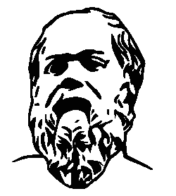
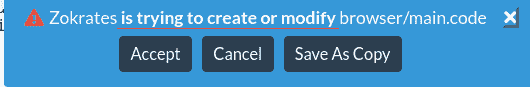

# 以太坊上的 zok rates-zkSNARKs(变得简单)

> 原文：<https://medium.com/coinmonks/zokrates-zksnarks-on-ethereum-made-easy-8022300f8ba6?source=collection_archive---------1----------------------->

ZkSNARKs(零知识简洁的非交互式知识论证)或有时被一些开发人员称为“黑魔法”通常被认为很难进入。

如果我们告诉你，有一种工具可以让这种流动像编写智能合同一样简单，会怎么样？

振作起来，ZoKrates 作为一个混音插件来了。

有关 ZoKrates 的文档，请打开[链接](https://zokrates.github.io/)。

# 从零到英雄(zkSNARKs 版)

我们将尝试一步一步地指导您完成编译、设置、导出验证器、计算见证和生成证明的过程。

我们走吧！

首先，在隐身模式下打开[混音 IDE](https://remix.ethereum.org) 。

导航到插件管理器并激活以下插件:

*   佐克拉特
*   可靠性编译器
*   部署和运行事务

然后进入 ZoKrates 插件，点击*示例*超链接，接受所需的权限。

根据自己的意愿更新代码(查看 ZoKrates 官方文档中关于[链接](https://zokrates.github.io/)的语言参考)。

# 汇编

一旦准备好，点击**编译**编译你的程序。

如果没有发生错误，您应该会看到一条编译成功的消息。

在编译面板的右侧，可以选择*复制字节码*或者*下载*编译输出。

# 设置

下一步是**设置**。点击设置展开，然后点击*运行设置*。

如果安装成功，您将看到此消息。点击*下载密钥*按钮，可以下载*验证*和*验证*密钥。

# 出口验证器

我们现在可以进入*出口验证器*步骤。

默认情况下，使用 ABI 的版本 1。在导出验证器之前，您可以通过勾选*使用 ABI v2* 复选框来使用版本 2。

如果一切顺利，你可以在 *Remix 编辑器*中打开生成的验证器或者*下载*验证器。通过点击 Remix 编辑器中的*打开*按钮，插件将在 Remix 编辑器中创建并打开 *verifier.sol* 文件。验证器的编译和部署将在后面进一步解释。

# 编译并部署一个验证器

现在让我们编译并部署一个 verifier.sol。

首先，进入 *Solidity 编译器*插件，点击编译 *verifier.sol* 。

完成后，进入*部署&运行事务*插件，从下拉列表中选择*验证器—浏览器/验证器. sol* ，然后点击部署。(您可以将它部署在 JavaScript VM 内部或任何其他 testnet 或 mainnet 上。要小心，因为这些是大合同，会消耗很多汽油。)

一旦我们完成了这个，让我们回到 ZoKrates 中的*计算见证*和*生成证明*部分。

# 计算见证

一个*计算见证*会要求你输入参数。填写完字段后，点击*计算*按钮生成见证。

如果执行时没有错误，将会出现一条成功消息。您可以通过在 Remix 编辑器中打开见证来检查它。如果您愿意，也可以下载见证。

# 生成证明

最后一步是*生成凭证*。点击*生成*。应该会显示如下所示的输出。

如果您还记得之前的内容，根据我们在导出验证器步骤中使用的 ABI 版本(ABI v1 与 ABI v2)，验证器中预期的证明格式是不同的。为了便于使用，您可以复制 *remix 兼容参数*，这是我们在下一步中使用的正确格式的证明。

你可以*复制输出*，*在混音编辑器*中打开或者*下载*就可以了。

# 核实

现在，要验证证据，请转到*部署&运行事务*插件，并将 remix 兼容参数粘贴到 *verifyTx* 字段中，然后单击 transact 按钮。

事务执行完成后，展开日志并检查*解码输出*部分。它应该显示 *"0": "bool: r true"* 。这意味着交易被成功验证。

基本就是这样。我们成功了！现在你是佐克拉特忍者了。欢迎加入俱乐部。最后看来 zkSNARKs 也没那么难，你不同意吗？；)

# 后续步骤

*   通过在浏览器外运行和/或优化和升级 ZoKrates 本身来提高更复杂程序的性能。

# 额外资源

*   [https://zokrates.github.io/sha256example.html](https://zokrates.github.io/sha256example.html)(原像证明)——如果你对更深入的解释感兴趣
*   https://z.cash/technology/zksnarks/
*   https://www.youtube.com/results?search _ query = bar+Ilan+winter+school+cryptography+Michael+walfish+snarks(Youtube 视频)
*   [http://people . csail . MIT . edu/Silvio/Selected % 20 scientific % 20 papers/Proof % 20 systems/The _ Knowledge _ composition _ Of _ Interactive _ Proof _ systems . pdf](http://people.csail.mit.edu/silvio/Selected%20Scientific%20Papers/Proof%20Systems/The_Knowledge_Complexity_Of_Interactive_Proof_Systems.pdf)
*   [https://eprint.iacr.org/2016/260](https://eprint.iacr.org/2016/260)

感谢 [*玄机 64*](https://github.com/dark64)*[*颜 300*](https://twitter.com/Yann300)*[和*沙夫*](https://github.com/Schaeff)*T21 的帮助。***

****

> **[直接在您的收件箱中获取最佳软件交易](https://coincodecap.com/?utm_source=coinmonks)**

****